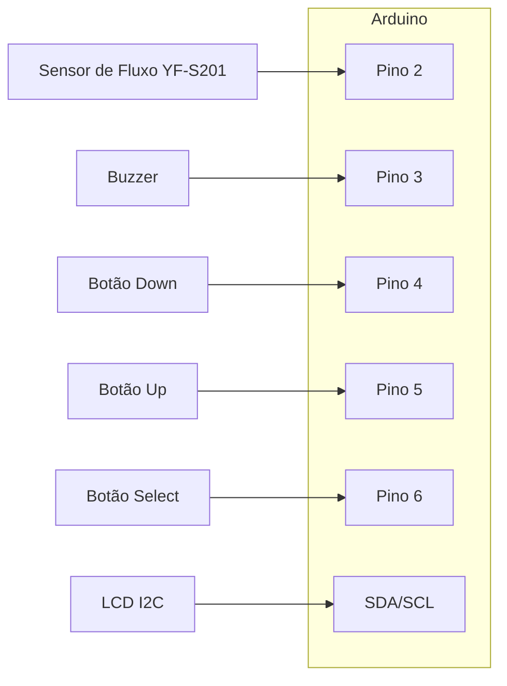

# 🚿 Smart Shower - Medidor Inteligente de Consumo de Água

**Smart Shower** é um projeto de Arduino que visa incentivar o consumo consciente de água durante o banho, exibindo em tempo real a quantidade de água utilizada, tempo de banho, frases motivacionais e dicas de economia. O sistema possui gamificação (recorde pessoal), menu de navegação e pode ser usado em feiras de ciências, escolas ou até mesmo no dia a dia em casa!

## ✨ Funcionalidades

* **Contador de Litros**: Mostra em tempo real quantos litros de água já foram usados.
* **Temporizador de Banho**: Permite definir um tempo limite para o banho.
* **Gamificação**: Guarda o recorde do menor consumo de água e número de banhos.
* **Frases Motivacionais & Dicas**: Mostra frases e dicas para economia de água no display.
* **Menu Navegável**: Navegue entre Temporizador, Contador Livre e Dicas usando botões físicos.
* **Feedback Sonoro**: Ao final do banho, emite sons conforme seu desempenho.
* **Interface com LCD**: Utiliza display I2C 16x2 para exibir informações.

## 🛠️ Componentes Utilizados

* Arduino Uno, Nano ou Mega
* Sensor de Fluxo de Água YF-S201 (ou similar)
* Display LCD 16x2 com interface I2C
* Buzzer (Piezo)
* 3 Botões (Up, Down, Select)
* Protoboard e jumpers
* Resistores de pull-up (caso necessário)

## 📦 Instalação

1. **Clone o repositório** ou baixe o arquivo `.ino`.

2. Instale as bibliotecas necessárias na IDE Arduino:

   * `LiquidCrystal_I2C`
   * `Wire` (já inclusa no Arduino)

3. **Monte o circuito** conforme o esquema abaixo:

   * Pino 2: Sinal do sensor de fluxo
   * Pino 3: Buzzer
   * Pino 4: Botão Down
   * Pino 5: Botão Up
   * Pino 6: Botão Select
   * Conecte o LCD via I2C (normalmente endereço 0x27 ou 0x3F)

4. Faça o upload do código para sua placa Arduino.

## ⚡ Esquema de Conexão

```
[Sensor de Fluxo] ---> Pino 2 do Arduino  
[Buzzer] -----------> Pino 3 do Arduino  
[Botão Down] -------> Pino 4  
[Botão Up] ---------> Pino 5  
[Botão Select] -----> Pino 6  
[LCD I2C] ----------> SDA/SCL
```

> Os botões devem ser ligados entre o pino e o GND (utilizando INPUT\_PULLUP no código).

## 🖼️ Diagrama de Montagem



## 🚦 Como Usar

1. **Ligue o Arduino** – O display mostrará o menu inicial.
2. **Use os botões Up/Down** para alternar entre:

   * Temporizador de banho
   * Contador livre
   * Dicas de economia
3. **Selecione com o botão Select**.
4. Durante o banho, acompanhe o consumo de água e o tempo!
5. Ao finalizar, confira sua pontuação e frases motivacionais!

## 🧠 Ideias para Expansão

* Adicionar integração com Wi-Fi/IoT (registro de consumo online)
* Suporte a mais idiomas
* Histórico de banhos em memória externa (EEPROM/SD)
* Versão para chuveiro coletivo/hotel

## 🤝 Contribua!

Pull requests são bem-vindos! Sinta-se à vontade para sugerir melhorias ou abrir issues.

### Como Contribuir

1. Faça um **fork** deste repositório.
2. Crie uma **branch** para sua modificação: `git checkout -b minha-feature`.
3. Realize suas alterações e faça *commits* claros.
4. Envie a branch para o seu fork: `git push origin minha-feature`.
5. Abra um **Pull Request** descrevendo suas mudanças.
6. Acompanhe a revisão e responda às sugestões.

## 📜 Licença

Este projeto está licenciado sob a [MIT License](LICENSE).

---

**Desenvolvido com carinho para inspirar o consumo sustentável de água!**

---
